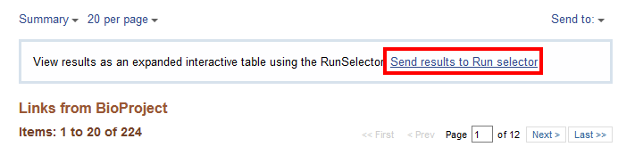
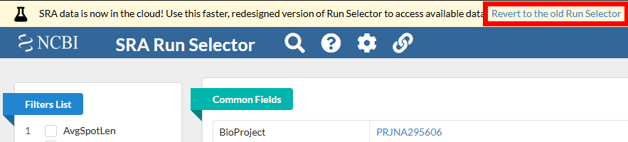
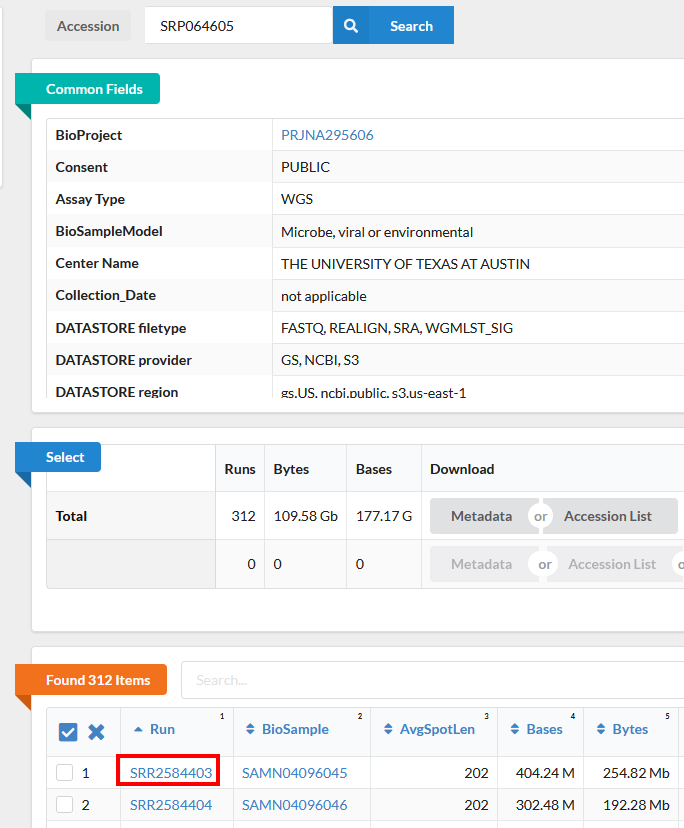
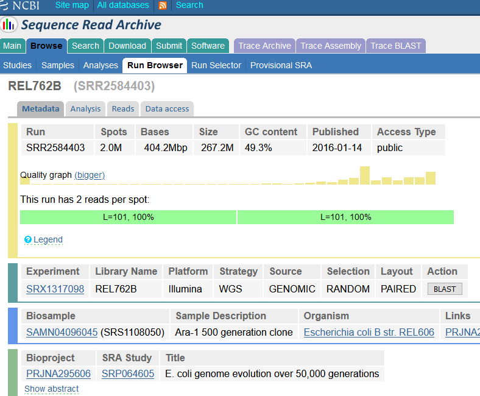
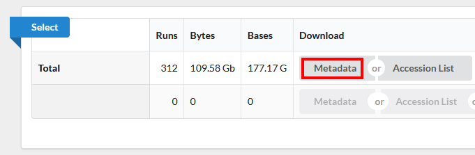
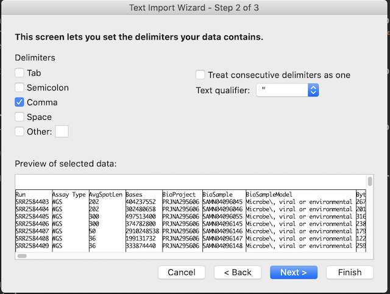

## Planning an analysis of sequencing data 

There are a variety of ways to work with a large sequencing dataset. In the most important ways, the methods and approaches we need in bioinformatics are the same ones we need at the bench or in the field - *planning, documenting, and organizing* are the key to good reproducible science.  

> ## Brainstorm: What questions you need to consider before you begin analysis of sequencing data? 
>
>  Let's say that you and your collaborator have planned a sequencing project, and have a proposed experimental design and set of samples ready to go. Before we go any further, take a moment to consider: What challenges do you think you'll face (or have already faced) in working with large sequencing data sets?  
>
> > ## Solution
> > Here are just a few possibilities: 
> > 
> > + What is your strategy for saving and sharing your sequence files?  
> > + How can you be sure that your raw data have not been unintentionally corrupted?  
> > + Where will my data be stored? How big do I anticipate the files to be? 
> > + Where/how will you (did you) analyze your data - what software, on what computer(s)?  
> {: .solution}
{: .challenge}

The exact questions you will need to ask yourself and your collaborators is dependent on exactly what kind of sequencing project you are doing, and what resources you might have available at your institution or workplace. The raw data you get back from the sequencing center is the foundation of your sequencing analysis. You need to keep this data, so that you can always come back to it if there are any questions or you need to re-run an analysis, or try a new analysis approach.

> ## Brainstorm: What are some guidelines for storing data? 
>
>  Let's say that you are the principal investigator for a lab that works with sequencing data on a regular basis. You want to create policies to make sure that data you don't lose your valuable data. Take a moment to write down a few potential rules or guidelines. 
>
> > ## Solution
> > Here are just a few possibilities.
> > + Store the data in a place that is accessible by you and other members of your lab - maybe create a shared data storage solution that you (the PI) and your lab manager can also access. 
> > + Store the data in a place that is redundantly backed up. It should be backed up in two locations that are in different physical areas.
Leave the raw data raw. You will be working with this data, but you do not want to modify this stored copy of the original data. 
> > + Leave the raw data raw. You will be working with this data, but you do not want to modify this stored copy of the original data. This means making copies for subsequent analyses. 
> > + What other ideas did you come up with? 
> {: .solution}
{: .challenge}

## Sending samples to the sequencing facility 

When you send your precious samples of DNA or RNA to a sequencing facility, they will require you to submit some information, or **metadata** about each of the samples. This information not only helps you keep track of the samples but also provides the sequencing center staff crucial information they will use to best prepare your samples for sequencing. For example, different input DNA concentrations may require different amounts of reagent and may lead to differing amounts of output sequence data.

As an example, the [Genome Sequencing Core][ku-gsc] of the University of Kansas (where I got my PhD!) requires the following information to be sent with each sample: 

+ Sample Name
+ DNA or RNA? 
+ DNA/RNA concentration in ng/uL 
+ How did you quantify that concentration? 
+ Sample volume (uL)
+ Should they run further quality control? 
+ Submit any relevant gel images 

> ## What other information will you want to have collected about your samples? 
> This will probably depend on the goals of the study, but could include:
> + Sample Collection date
> + Sample location date (if location is important to your study)
> + Sample sex (if important or known)
> + Sample treatment (experimental condition)
> + Probably many other things relevant to your experimental design!
{: .solution}

## Receiving your data from the sequencing facility

When the data come back from the sequencing facility, you will receive some documentation (more metadata) as well as the sequence files themselves. Download and examine the following example file - here provided as a text file and Excel file:

- [Sequencing results - text](../files/sequencing_results_metadata.txt)
- [Sequencing results - Excel](../files/sequencing_results_metadata.xls)

> ## Exercise
> Open the data file in the analysis program of your choice and see if you can answer the following questions: 
> 1. How are these samples organized?
> 2. What type of sequencing projects did these samples come from? 
> 3. What do you think the \_R1/\_R2 extensions mean in the file names? 
> 4. What does the '.gz' extension on the filenames indicate?
> 5. What is the total file size?
>
> > ## Solution
> >
> > 1. Samples are organized by sample_id (the first column). 
> > 2. These samples are from an RNA-Seq project
> > 3. The \_R1/\_R2 extensions mean "Read 1" and "Read 2" of each sample. We will be learning more about what this means soon!
> > 4. The '.gz' extension means it is a compressed "gzip" type format to save disk space
> > 5. The size of all the files combined is 1113.60 Gb (over a terabyte!). To transfer files this large you should validate the file size following transfer. Absolute file integrity checks following transfers and methods for faster file transfers are possible but beyond the scope of this lesson. 
> >
> {: .solution}
{: .challenge}

## Examining Data on the NCBI SRA Database

In our experiments we usually think about generating our own sequencing data. However, almost all analyses use reference data, and you may want to use it to compare your results or annotate your data with publicly available data. You may also want to do a full project or set of analyses using publicly available data. This data is a great, and essential, resource for genomic data analysis.

When you come to publish a paper including your sequencing data, most journals and funders require that you place your data on a public repository. Sharing your data makes it more likely that your work will be re-used and cited. It helps to prepare for this early!

There are many repositories for public data. Some model organisms or fields have specific databases, and there are ones for particular types of data. Two of the most comprehensive public repositories are provided by the [National Center for Biotechnology Information  (NCBI)](https://www.ncbi.nlm.nih.gov) and the [European Nucleotide Archive (EMBL-EBI)](https://www.ebi.ac.uk/). The NCBI's [Sequence Read Archive (SRA)](https://trace.ncbi.nlm.nih.gov/Traces/sra/) is the database we will be using for this lesson, but the EMBL-EBI's Nucleic Acid Archive (ENA) is also useful. The general processes are similar for any database.

# Accessing the original archived data

The [sequencing dataset (from Tenaillon, *et al.* 2016) adapted for this lesson](http://www.datacarpentry.org/organization-genomics/data/) was obtained from the [NCBI Sequence Read Archive](http://www.ncbi.nlm.nih.gov/sra), which is a large (~27 petabasepairs/2.7 x 10^16 basepairs as of April 2019) repository for next-generation sequence data. Like many NCBI databases, it is complex and mastering its use is greater than the scope of this lesson. Very often there will be a direct link (perhaps in the supplemental information) to where the SRA dataset can be found. We are only using a small part of these data, so a direct link cannot be found. If you have time, go through the following detailed description of finding the data we are using today (otherwise skip to the next section). 

## Locate the Run Selector Table for the Lenski Dataset on the SRA

See the figures below for how information about data access is provided within the original paper. 

The **above image** shows the title of the study, as well as the authors.

The excerpt from the paper below includes information on how to locate the sequence data. In this case, the text appears just before the reference section.

> **Author Information** All sequencing data sets are available in the NCBI
> BioProject database under accession number PRJNA294072. The *breseq*
> analysis pipeline is available at GitHub ([http://github.com/barricklab/breseq](https://github.com/barricklab/breseq/)).
> Other analysis scripts are available at the Dryad Digital Repository ([http://dx.doi.org/10.5061/dryad.6226d](https://doi.org/10.5061/dryad.6226d)). R.E.L. will make strains available to qualified
> recipients, subject to a material transfer agreement. Repreints and permissions
> information is available at www.nature.com/reprints. The authors declare no
> competing financial interests. Readers are welcome to comment on the online
> version of the paper. Correspondence and requests for materials should be
> addressed to R.E.L. (lenski *at* msu.edu)

**This lesson uses a *subset* of SRA files, from a small *subproject* of the BioProject database 
"PRJNA294072". To find these data you can follow the instructions below:** 

1. Notice that the paper references "PRJNA294072" as a "BioProject" at NCBI. If you go to the [NCBI website](https://www.ncbi.nlm.nih.gov/) and search for "PRJNA294072" you will be shown a link to the "Long-Term Evolution Experiment with E. coli" BioProject. Here is the link to that database: [https://www.ncbi.nlm.nih.gov/bioproject/?term=PRJNA294072](https://www.ncbi.nlm.nih.gov/bioproject/?term=PRJNA294072). 

2. Once on the BioProject page, scroll down to the table under **"This project encompasses the 
following 14 sub-projects:"**. 

3. In this table, select **subproject** 
*"[PRJNA295606](https://www.ncbi.nlm.nih.gov/bioproject/295606)	SRA or Trace	Escherichia coli B str. REL606	E. coli genome evolution over 50,000 generations (The University of Texas at...)"*. 

4. This will take you to a page with the subproject description, and a table **"Project Data"** 
that has a link to the 224 SRA files for this subproject. **Note that this is an ongoing project so the number of sub-projects and available SRA files might be changed since the writing of this lesson**.  

5. Click on the number 
["224"](https://www.ncbi.nlm.nih.gov/sra?linkname=bioproject_sra_all&from_uid=295606) next to "SRA Experiments" and it will take you to the SRA page for this subproject. 

6. **Recommended**: For a more organized table, select "Send results to Run selector". This 
takes you to the Run Selector page for BioProject PRJNA295606 (the BioProject number for the experiment SRP064605) that is used in the next section. The run selector is being updated, at this point you can either use the redesigned SRA Run Selector (recommended) or revert to the old Run Selector.

## Download the Lenski SRA data from the (newer) SRA Run Selector Table

1. Make sure you access the Tenaillon dataset from the provided link: [https://trace.ncbi.nlm.nih.gov/Traces/study/?acc=SRP064605](https://trace.ncbi.nlm.nih.gov/Traces/study/?acc=SRP064605). This is NCBI’s new cloud-based SRA interface. You will be presented with a page for the overall SRA accession SRP064605 - this is a collection of all the experimental data. 

2. At the top of the page is an option to switch back to the “old Run Selector”. We will discuss that later.

3. Notice on this page there are three sections. “Common Fields” “Select”, and “Found 312 Items”. Within “Found 312 Items”, click on the first Run Number (Column “Run” Row “1”). 

4. This will take you to a page that is a run browser. Take a few minutes to examine some of the descriptions on the page.

5. **Use the browser’s back button to go back to the 'previous page'**. As shown in the figure below, the second section of the page (“Select”) has the **Total** row showing you the current number of “Runs”, “Bytes”, and “Bases” in the dataset to date. As of 2021-09-08 there were 312 runs, 109.58 Gb data, and 177.17 Gbases of data. 

6. Click on the “Metadata” button to download the data for this lesson. The filename is “SraRunTable.txt” and save it on your computer Desktop.

> ## Downloading the Lenski SRA data from the SRA Run Selector Table using the old Run Selector
> 
> Go to the [“old Run Selector” instructions](../old-ncbi/index.html) page and return here after downloading your `SraRunTable.txt` file.
> 
> We include the “old Run Selector” page because the webpages ***and*** downloaded file `SraRunTable.txt` are slightly different. 
{: .callout}

**You should now have a file called `SraRunTable.txt`**

## Review the SraRunTable in a spreadsheet program

Using your choice of spreadsheet program, open the `SraRunTable.txt` file. If prompted by the spreadsheet software be aware that the ***newer***  NCBI Run Selector provides a **comma-separated** file (often given a suffix of `.csv`), however if you used the ***older***  SRA Run Selector, this is a **tab-separated** file (often given the suffix of `.tsv`). 

Now you know that comma-separated and tab-separated files are both "text" files but use either commas or tabs as **delimiters**, respectively. They both are sometimes suffixed with `.txt`. 

> ## Opening a `.csv` file in Excel
> Your version of Excel may not properly open this `.csv` file without some intervention. You may need to do the following if Excel does not does not properly separate the columns:
> 1. Open Excel and go to `File >> Open` and find where you downloaded `SraRunTable.txt`. 
> 2. The window that opens should indicate that the Text Import Wizard has determined the data is delimited. If so, leave everything as-is and click **Next**.
> 3. In `Text Import Wizard - Step 2 or 3` make sure that `Comma` instead of anything else. The window should look pretty much just like the following. 
> 
> 
> 4. Click through the next window without changing everything. Each variable should now be in its own column (much easier to read!). You may need to use this trick to examine files in future lessons. 
{: .callout}

Once your CSV file is open in your spreadsheet program of choice, try to answer the following about your data: 

> ## Examining the SRA Run Table 
>
> 1. What strain of *E. coli* was used in this experiment?
> 2. What was the sequencing platform used for this experiment?
> 3. What samples in the experiment contain
> [paired end](http://www.illumina.com/technology/next-generation-sequencing/paired-end-sequencing_assay.html)
> sequencing data?
> 4. What other kind of data is available?
> 5. Why are you collecting this kind of information about your sequencing runs?
> 6. What SRA Run number should we use to download sequencing data for Sample `REL768B`? 
> > ## Solution
> > 1. Escherichia coli B str. REL606 shown under the "organism" column. This is a tricky question because the column labeled "strain" actually has sample names
> > 2. The Illumina sequencing platform was used shown in the column "Platform". But notice they used multiple instrument types listed under "Instrument"
> > 3. Sort by LibraryLayout and the column "DATASTORE_filetype" shows that "minhash_sig realign ref_stats sra wgmlst_sig" were used for all single-end reads. (Also notice the Illumina Genome Analyzer IIx was never used for paired-end sequencing)
> > 4. There are several columns including: megabases of sequence per sample, Assay type, BioSample Model, and more.
> > 5. These are examples of "metadata" that you should collect for sequencing projects that are sent to public databases. 
> > 6. Find `REL768B` in the **Sample Name** column. That should correspond to Run `SRR2584409`. Keep a note of this for the next step!
> {: .solution}
{: .challenge}

After answering the questions, you should avoid saving any changes you might have made to this file. We do not want to make any changes. If you were to save this file, make sure you save it as a plain `.txt` file. 

## Where to learn more

#### About the Sequence Read Archive

* You can learn more about the SRA by reading the [SRA Documentation](http://www.ncbi.nlm.nih.gov/Traces/sra/)  
* The best way to transfer a large SRA dataset is by using the [SRA Toolkit](http://www.ncbi.nlm.nih.gov/Traces/sra/?view=toolkit_doc)  

#### References

Tenaillon O, Barrick JE, Ribeck N, Deatherage DE, Blanchard JL, Dasgupta A, Wu GC, Wielgoss S, Cruveiller S, Médigue C, Schneider D, Lenski RE.
Tempo and mode of genome evolution in a 50,000-generation experiment (2016) Nature. 536(7615): 165–170.  
[Paper](https://www.ncbi.nlm.nih.gov/pmc/articles/PMC4988878/), [Supplemental materials](https://www.ncbi.nlm.nih.gov/pmc/articles/PMC4988878/#)  
Data on NCBI SRA: [https://trace.ncbi.nlm.nih.gov/Traces/sra/?study=SRP064605](https://trace.ncbi.nlm.nih.gov/Traces/sra/?study=SRP064605)  
Data on EMBL-EBI ENA: [https://www.ebi.ac.uk/ena/data/view/PRJNA295606](https://www.ebi.ac.uk/ena/data/view/PRJNA295606)
