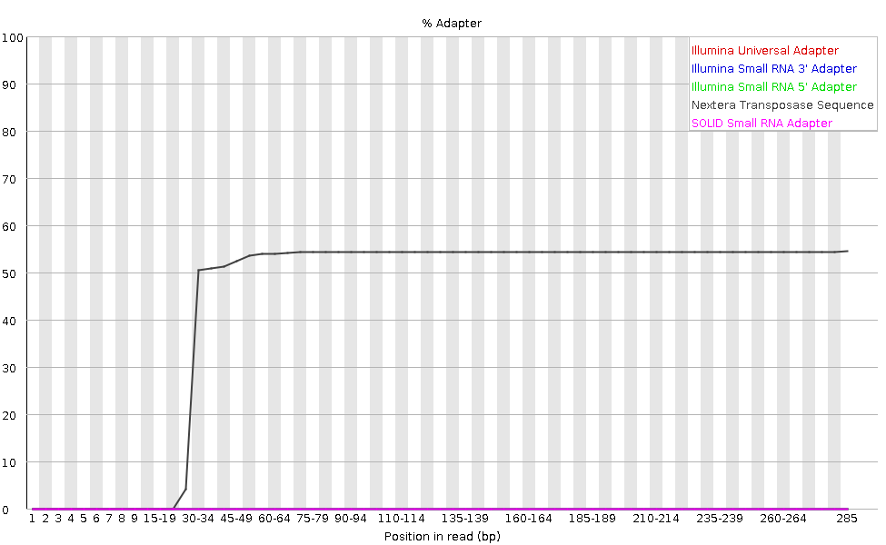

> ## Prerequisites
> **This tutorial assumes the following:**
> + You have created a Galaxy account and can log in to it.
> + You have created a fresh, empty Galaxy history for this tutorial
> + You are familiar with the general format of a FASTQ file and Phread quality scores (watch the lecture if you haven't already!)
> + You have completed the previous tutorial on "Metadata and the NCBI SRA"
{: .prereq}

# Bioinformatic workflows

When working with high-throughput sequencing data, the raw reads you get off of the sequencer will need to pass
through a number of  different tools in order to generate your final desired output. The execution of this set of
tools in a specified order is commonly referred to as a *workflow* or a *pipeline*. 

This week, we are going to be learning about a two-step workflow that is common to almost all sequencing projects: 

1. Quality control - Assessing quality using FastQC
2. Quality control - Trimming and/or filtering reads (if necessary)

**We will be building onto this workflow in subsequent weeks!** 

# Getting the data into Galaxy

Often times, the first step in a bioinformatic workflow is getting the data you want to work with onto a computer (or server, in our case) where you can work with it. If you have outsourced sequencing of your data, the sequencing center will usually provide you with a link that you can use to download your data. Today we will be working with publicly available sequencing data. Luckily, as you saw in the **Galaxy 101** Tutorial, it is quite easy to get data onto the Galaxy server. 

> ## Hands-On: Importing using an SRA accession
> 1. In the **Get Data** section of the Tools panel, locate the <button type="button" class="btn btn-outline-tool" style="pointer-events: none"> Faster Download and Extract Reads in FASTQ </button> tool. 
> 2. Input type should be `SRR accession`.
> 3. In the `Accession` box, type the Run Number we found in the previous exercise: `SRR2584864`. 
> 4. Press Execute. Since this program is downloading and extracting a relatively large file, this may take a few moments.
> 5.  Take a look at the entries that were created in your history panel: 
>	+ `Pair-end data (fasterq-dump)`: Contains Paired-end datasets (if available).
> 	+ `Single-end data (fasterq-dump)`:  Contains Single-end datasets (if available).
> 	+ `Other data (fasterq-dump)`:  Contains Unpaired datasets (if available).
>	+ `fasterq-dump log`: Contains Information about the tool execution.
{: .challenge}

> ## Is the data we downloaded **single-end** or **paired-end** data?
> Our data is **single-end**! If you click each of the data files generated that are now in your history, you will see that `Pair-end data (fasterq-dump)` is an empty list, meaning that the tool did not download any files of that type. 
> 
>  On the other hand, `Single-end data (fasterq-dump)` is a "list with 1 item", which is a FASTQ-formatted file if you look inside: 
> 
{: .solution}

## Quick review of the FASTQ format

Although it looks complicated (and it is), we can understand the [fastq](https://en.wikipedia.org/wiki/FASTQ_format) format with a little decoding. Some rules about the format include...

|Line|Description|
|----|-----------|
|1|Always begins with '@' and then information about the read|
|2|The actual DNA sequence|
|3|Always begins with a '+' and sometimes the same info in line 1|
|4|Has a string of characters which represent the quality scores; must have same number of characters as line 2|

So for example, the first sequence in our file is:

~~~
@SRR2584864.1 HWUSI-EAS1599:83:70G3AAAXX:2:1:2872:932 length=75
NATCGAACAAGATGTGGTGTTGCACTGTCGGAGCGGCGGCAGTTACGACGTGCATTACAGTATTACGCCGTTAAG
+SRR2584864.1 HWUSI-EAS1599:83:70G3AAAXX:2:1:2872:932 length=75
#122177785@CC@@@@@@@CC@@@@CC@C@@C@C@@@@;78999@@@@@@@@@@<<<:<<:<<<@@@@@@@@@@
~~~
{: .output}

The quality score for each sequence is a string of characters, one for each base of the nucleic sequence, used to characterize the probability of mis-identification of each base. So there is an ASCII character associated with each nucleotide, representing its [Phred quality score](https://en.wikipedia.org/wiki/Phred_quality_score), the probability of an incorrect base call:

Phred Quality Score | Probability of incorrect base call | Base call accuracy
--- | --- | ---
10 | 1 in 10 | 90%
20 | 1 in 100 | 99%
30 | 1 in 1000 | 99.9%
40 | 1 in 10,000 | 99.99%
50 | 1 in 100,000 | 99.999%
60 | 1 in 1,000,000 | 99.9999%

The translation between the ASCII symbols and the numerical Phred scores (Q-scores) can be found in this [quality score encoding table](https://support.illumina.com/help/BaseSpace_OLH_009008/Content/Source/Informatics/BS/QualityScoreEncoding_swBS.htm) provided by Illumina. 

> ## Challenge: Interpreting FASTQ scores
> 1. What is ASCII symbol for the 10th nucleotide in the first read (above)? 
> 2. What Phred score does this correspond to? 
> 3. Should we be worried about the accuracy of this base call?
> 4. What does it mean that the first nucleotide of this read is an "N"? 
> 
> > ## Solution
> > 1. The 10th nucleotide has a ASCII score of "5". 
> > 2. This translates to a Phred score of **20**, which means that the base call accuracy is 99%. 
> > 3. While an error rate of 1 in 100 sounds pretty good, over millions of basepairs of sequencing in a project, this can really add up! We may want to think about filtering this read out if it has many low-quality bases. 
> > 4. An "N" means that the sequencer (or subsequent piece of software) could not identify the base at this position. Notice that it also has a Phred score of **2**, one of the lowest possible scores! 
> {: .solution}
{: .challenge}

## Assessing overall read quality using FASTQE 🧬😎
To take a look at sequence quality along all sequences, we can use FASTQE. It is an open-source tool that provides a simple and fun way to quality control raw sequence data and print them as emoji. You can use it to give a quick impression of whether your data has any problems of which you should be aware before doing any further analysis. 

> ## Hands-on: Quality check
>
> 1. Find the <button type="button" class="btn btn-outline-tool" style="pointer-events: none"> FASTQE </button> tool, and run it with the following parameters: 
>    - *"FastQ data"*: `SRR2584864 (fastq-dump`.
>    - *"Score types to show"*: `Mean`. 
> 2. Inspect the generated HTML file.
>
{: .challenge}

Rather than looking at quality scores for each individual read, FASTQE looks at quality collectively across all reads within a sample and can calculate the mean for each nucleotide position along the length of the reads. Below shows the mean values for this dataset.

> ## What is the lowest mean score in this data set? 
> 
> 
> 
{: .solution} 

## Assessing quality in more detail using FASTQC

An additional or alternative way we can check sequence quality is with [FastQC](https://www.bioinformatics.babraham.ac.uk/projects/fastqc/). It provides a modular set of analyses which you can use to check whether your data has any problems of which you should be aware before doing any further analysis.  We can use it, for example, to assess whether there are known adapters present in the data. We'll run it on the FASTQ file.

> ## Hands-on: FASTQC
>
> 1. Find the <button type="button" class="btn btn-outline-tool" style="pointer-events: none"> FASTQC </button> tool, and run it with the following parameters: 
>    - *"Short read data from your current history"*: `SRR2584864 (fastq-dump)`.
> 2. Inspect the generated HTML file.
{: .challenge}

We are going to focus on several of the output categories that will help you tell most immediately that there are serious issues with your data: 
	+ Per-base sequence quality
	+ Per-sequence quality scores
	+ Adapter content

## Per base sequencing quality

With FastQC we can use the per base sequence quality plot to check the base quality of the reads, similar to what we did with FASTQE. Here is the output for `SRR2584864`: 

For each position, a boxplot is drawn with:

- the median value, represented by the central red line
- the inter-quartile range (25-75%), represented by the yellow box
- the 10% and 90% values in the upper and lower whiskers
- the mean quality, represented by the blue line

The y-axis shows the quality scores. The higher the score, the better the base call. The background of the graph divides the y-axis into very good quality scores (green), scores of reasonable quality (orange), and reads of poor quality (red).

It is normal with all Illumina sequencers for the median quality score to start out lower over the first 5-7 bases and to then rise. The quality of reads on most platforms will drop at the end of the read. This is often due to signal decay or phasing during the sequencing run. The recent developments in chemistry applied to sequencing has improved this somewhat, but reads are now longer than ever.

### Some problematic base-quality profiles:

These are some per base sequence quality profiles that can indicate issues with the sequencing. 

1. **Overclustering** : Sequencing facilities can overcluster the flow cells. It results in small distances between clusters and an overlap in the signals. Two clusters can be interpreted as a single cluster with mixed fluorescent signals being detected, decreasing signal purity. It generates lower quality scores across the entire read.

2. **Issues with the sequencer**: Some issues can occasionally happen with the sequencing instruments during a run. Any sudden drop in quality or a large percentage of low quality reads across the read could indicate a problem at the facility. With such data, the sequencing facility should be contacted for discussion. Troubleshooting these patterns is outside of the scope of this course, but any sudden drop in quality or a large percentage of low quality reads across the read could indicate a problem at the facility. Often, a resequencing then is needed (and from our experience also offered by the company). 

Manifold burst:

Cycles loss: 

## Adapter content

The plot shows the cumulative percentage of reads with the different adapter sequences at each position. Once an adapter sequence is seen in a read it is counted as being present right through to the end of the read so the percentage increases with the read length. FastQC can detect some adapters by default (e.g. Illumina, Nextera), for others we could provide a contaminants file as an input to the FastQC tool.

This is the adapter profile for `SRR2584864`. This is already very nice looking sequence data - ideally Illumina sequence data should not have adapters anywhere in the reads: 

But with long reads, some of the library inserts are shorter than the read length resulting in read-through to the adapter at the 3’ end of the read, creating a profile that would look like this: 

> ## Optional: More info about adapter read-through
> Many sequencing technologies, such as the short-read Illumina data we are working with today, require adapter sequences to be added to the pieces of DNA we want to sequence in order to prime the sequencing reaction(s) that will be taking place on those pieces of DNA, pictured here for **paired-end** reads: 
> 
> 
> 
> In certain circumstances, the adapters themselves will be sequenced. One such situation is if some pieces of the actual DNA to be sequenced are shorter than the chosen read length of the sequencing run. For example, if we were targeting 100bp reads, but some of the DNA was very fragmentary and only 80bp long, these sequences would have about 20bp each of "_adapter read-through_" (pictured in red above). 
> 
> In the most extreme case, if the input DNA is very low concentration and/or small, the sequencing adapters (and/or the sequencing primers) will anneal directly to one another instead of any target sequence during preparation of the sequencing library and then get sequenced. These are called "adapter dimers" and "primer dimers", respectively.  
{: .solution}

## Per-sequence quality scores

It plots the average quality score over the full length of all reads on the x-axis and gives the total number of reads with this score on the y-axis. This is the plot for `SRR2584864`. The distribution of average read quality should be tight peak in the upper range of the plot, as we can already see with our sample: 

An distribution like the following, with another peak of sequences with lower quality, could be indicative of a problem with the sequencer, like those mentioned above: 

## Decoding the other FastQC outputs

We've now looked at quite a few "Per base sequence quality" FastQC graphs, but there are nine other graphs that we haven't talked about! Below is a a brief overview of interpretations for each of these plots. For more information, please see the FastQC documentation [here](https://www.bioinformatics.babraham.ac.uk/projects/fastqc/Help/). Some of these plots will be discussed in future weeks as they are more relevant for certain sequencing types. 

+ [**Per tile sequence quality**](https://www.bioinformatics.babraham.ac.uk/projects/fastqc/Help/3%20Analysis%20Modules/12%20Per%20Tile%20Sequence%20Quality.html): the machines that perform sequencing are divided into tiles. This plot displays patterns in base quality along these tiles. Consistently low scores are often found around the edges, but hot spots can also occur in the middle if an air bubble was introduced at some point during the run. 
+ [**Per base sequence content**](https://www.bioinformatics.babraham.ac.uk/projects/fastqc/Help/3%20Analysis%20Modules/4%20Per%20Base%20Sequence%20Content.html): plots the proportion of each base position over all of the reads. Typically, we expect to see each base roughly 25% of the time at each position, but this often fails at the beginning or end of the read due to quality or adapter content.
+ [**Per sequence GC content**](https://www.bioinformatics.babraham.ac.uk/projects/fastqc/Help/3%20Analysis%20Modules/5%20Per%20Sequence%20GC%20Content.html): a density plot of average GC content in each of the reads.  
+ [**Per base N content**](https://www.bioinformatics.babraham.ac.uk/projects/fastqc/Help/3%20Analysis%20Modules/6%20Per%20Base%20N%20Content.html): the percent of times that 'N' occurs at a position in all reads. If there is an increase at a particular position, this might indicate that something went wrong during sequencing.  
+ [**Sequence Length Distribution**](https://www.bioinformatics.babraham.ac.uk/projects/fastqc/Help/3%20Analysis%20Modules/7%20Sequence%20Length%20Distribution.html): the distribution of sequence lengths of all reads in the file. If the data is raw, there is often on sharp peak, however if the reads have been trimmed, there may be a distribution of shorter lengths. 
+ [**Sequence Duplication Levels**](https://www.bioinformatics.babraham.ac.uk/projects/fastqc/Help/3%20Analysis%20Modules/8%20Duplicate%20Sequences.html): A distribution of duplicated sequences. In sequencing, we expect most reads to only occur once. If some sequences are occurring more than once, it might indicate enrichment bias (e.g. from PCR). If the samples are high coverage (or RNA-seq or amplicon), this might not be true.  
+ [**Overrepresented sequences**](https://www.bioinformatics.babraham.ac.uk/projects/fastqc/Help/3%20Analysis%20Modules/9%20Overrepresented%20Sequences.html): A list of sequences that occur more frequently than would be expected by chance. 
+ [**Adapter Content**](https://www.bioinformatics.babraham.ac.uk/projects/fastqc/Help/3%20Analysis%20Modules/10%20Adapter%20Content.html): a graph indicating where adapater sequences occur in the reads.
+ [**K-mer Content**](https://www.bioinformatics.babraham.ac.uk/projects/fastqc/Help/3%20Analysis%20Modules/11%20Kmer%20Content.html): a graph showing any sequences which may show a positional bias within the reads.

## Trimming and Filtering the Reads

Trimming can help to increase the number of reads the aligner or assembler are able to succesfully use, reducing the number of reads that are unmapped or unassembled. In particular, because we are going to eventually want to do variant-calling with sequencing data, we want to be very confident in the base calls in our reads to avoid calling any false variants. 

In general, quality treatments include:

1. Trimming/cutting/masking sequences
    - from low quality score regions
    - beginning/end of sequence
    - removing adapters
2. Filtering of sequences
    - with low mean quality score
    - too short
    - with too many ambiguous (N) bases

To accomplish this task we will use [Cutadapt](https://cutadapt.readthedocs.io/en/stable/guide.html) a tool that enhances sequence quality by automating adapter trimming as well as quality control.  We will:

- Trim low-quality bases from the ends. Quality trimming is done before any adapter trimming. We will set the quality threshold at 30, aiming for an error rate of only 1 in 1000 bases. 
- Trim any sequencing adapters with Cutadapt. We will trim that sequence from the 3' end of the reads.
- Filter out sequences with length < 20 after trimming.

> ## Challenge: Predict the effects of trimming
> 
{: .details}
